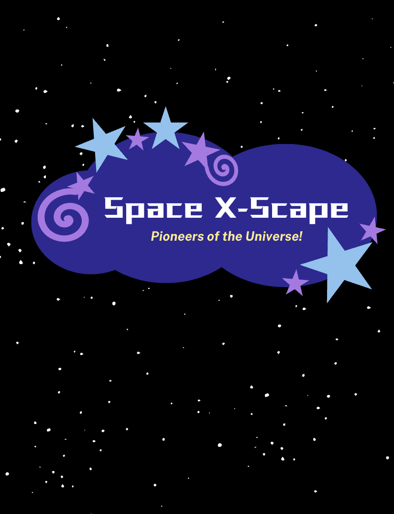

# Space X-scape
This game is designed to engage middle school-aged students in learning about exoplanets through an interactive, fun experience. With a focus on accessibility, the game aims to reach kids in underserved communities, providing them with valuable science education on exoplanets without the need for expensive materials or technology.

The game blends education with entertainment by encouraging players to explore various exoplanets, making discoveries, and earning points based on their knowledge and findings. The goal is to spark curiosity and excitement about space science while offering an easily accessible learning platform for students who might not otherwise have exposure to this area of knowledge. By delivering complex topics like exoplanets in a playful, approachable way, this project aims to inspire the next generation of scientists and explorers.

This is the link to the instruction, board game, cards, and game pieces:
[https://drive.google.com/drive/folders/1qZ838H7judPCWpGyDj9ChPCFmg1zR2l6?usp=sharing] 
(Space X-Scape: Pioneers of the Universe - Google Drive)

